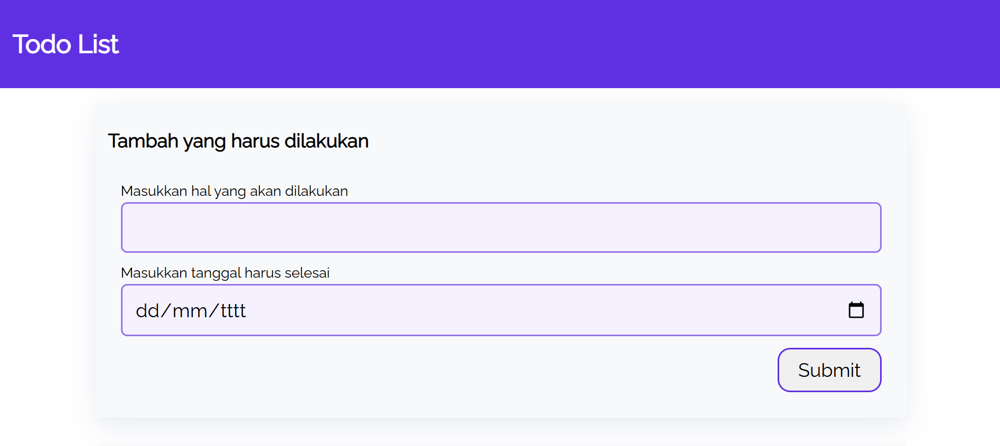
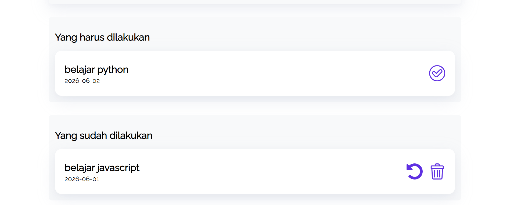

# TodoApps
Praktik membuat TodoApps kelas dicoding ***Belajar Membuat Front-End Web Pemula***, TodoApps adalah aplikasi to-do list berbasisi web sederhana. Aplikasi ini memungkinkan pengguna untuk menambah, menyelesaikan, mengembalikan, dan menghapus daftar tugas. Data disimpan menggunakan `localstorage` sehingga tidak hilang saat direfresh atau ditutup

**PREVIEW** 

**LINK =>** https://alfario207.github.io/TodoApps/